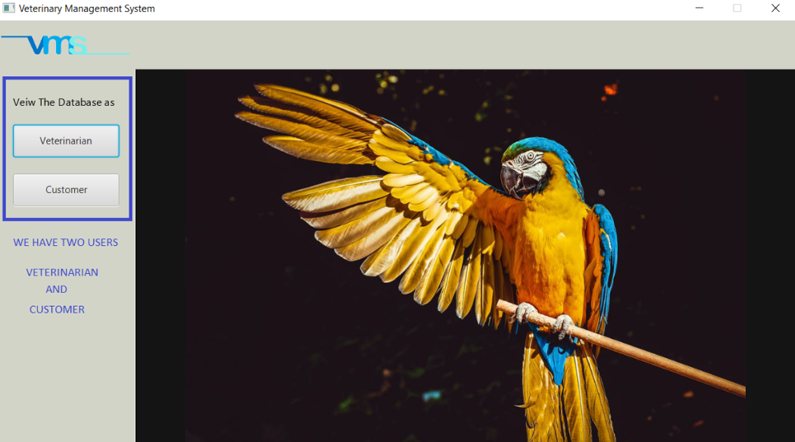
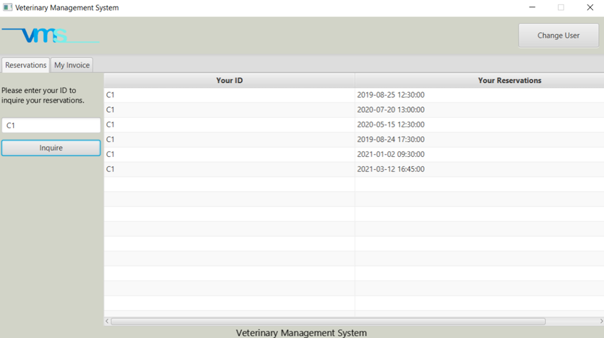
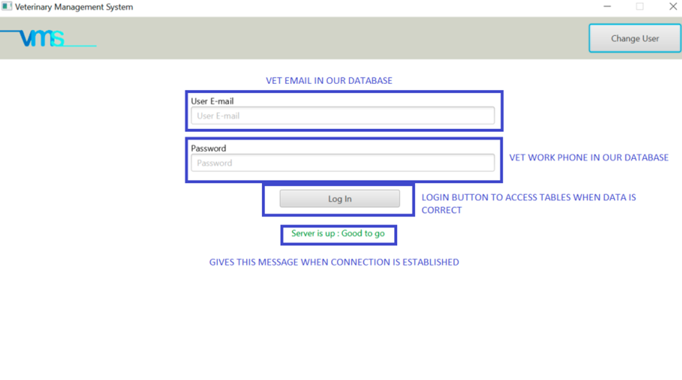
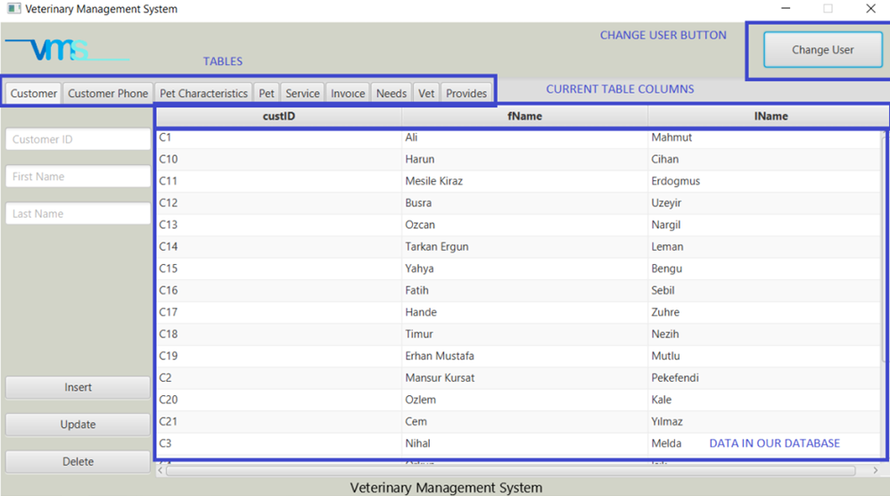
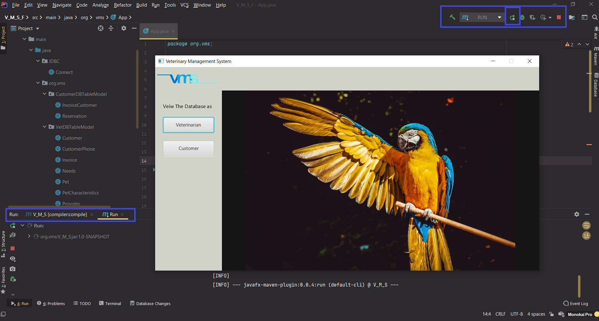
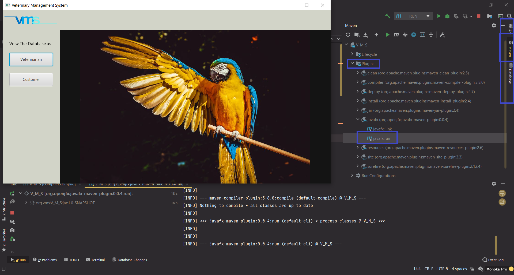
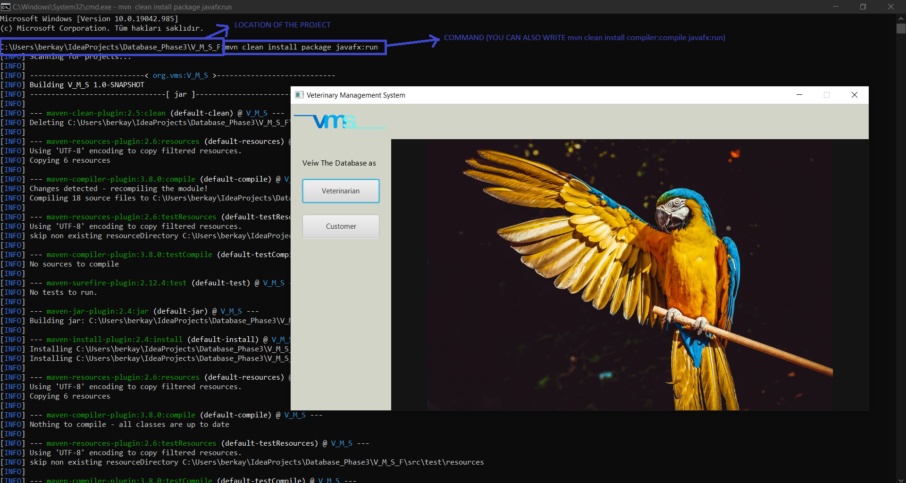
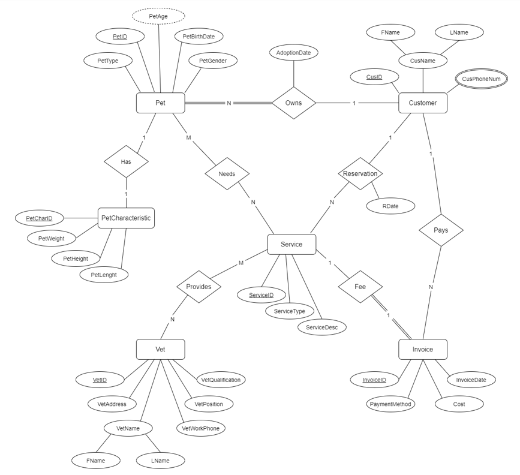

# Veterinary Management System

Simple veterinary management system build using JavaFX

## Overview

When we start the program, the user selection screen welcomes us.In this screen we have two options.
First one is viewing the database as Veterinarian and the second, option is to view the database as Customer.

If the user selects the Customer button a screen as follows opens.

By writing your customer id and clicking the inquire button our customer can view his/her past reservations and up coming ones.

In My invoices section the same logic and the same interface was implemented. If the user enters his/her customer id the system checks the database specially invoice table to find invoices for this specific customer.

If the interface user selects view the database as Veterinarian user goes to a login screen. To log in this section, the user must be veterinarian. The email and the password (Vet Work Phone) of user must be in the database after checking the validness of the information that is entered then the user can view this section of the interface. Also, under the button we have a label that tells us the status of the database connection.

After logging in to the veterinary interface we can view our database with all the tables. Tables are added into tabs named as same as table names in our database. The information in our database printed into the interface using Table View and Table Column attributes.

Veterinarian can also manipulate the date in our database by using insert, update and delete functionality.

## How to run?

Before running the program.

First of all you have to modify the Connect.java class which is placed in src/main/java/JDBC/Connect.java
in this class database connection properties are given. Change those properties to fit your database.(Like your localhost password and port number(THIS IS IMPORTANT!)

Implement the database by using VMSDBSQL.SQL file it is placed in `src/main/vmsDB/VMSDBSQL.SQL`
or you can simply add our updated veterinary_management_system(final).sql file (from Phase2) to XAMPP , MySQL Workbench etc..

You don’t need to add vm options or external libraries. JavaFX and MYSQL Connector/J is implemented
via Maven, in the indexing phase those libraries will be downloaded automatically.

 3 different ways to run the project

1. By opening the V_M_S_F file in an IDE (IntelliJ or Eclipse) basically press the run button.
   
2. In IntelliJ at the right there is a tab called Maven by opening it you will reveal 3 packages.
   n the Plugins then the javafx package after that double click the `javafx:run`
   
3. By using CMD (Terminal) go into the path of V_M_S_F package and run the following command
   ``mvn clean install package javafx:run``
   

## Database Design

## IMPORTANT NOTE on INSERT/UPDATE/DELETE OPERATIONS:

If you want an efficient database app, you should make an "insert" operation considering the following order.

customer -> customerphonenumber -> PetCharacteristic -> Pet ->  Service -> Invoice -> Needs -> Vet -> Provides

-Also, you cannot update IDs in all tables because these IDs are unique.(Only insert and delete)
